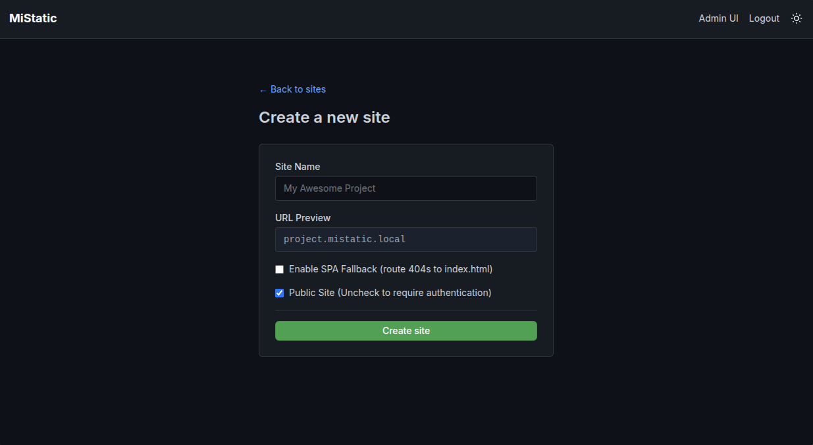
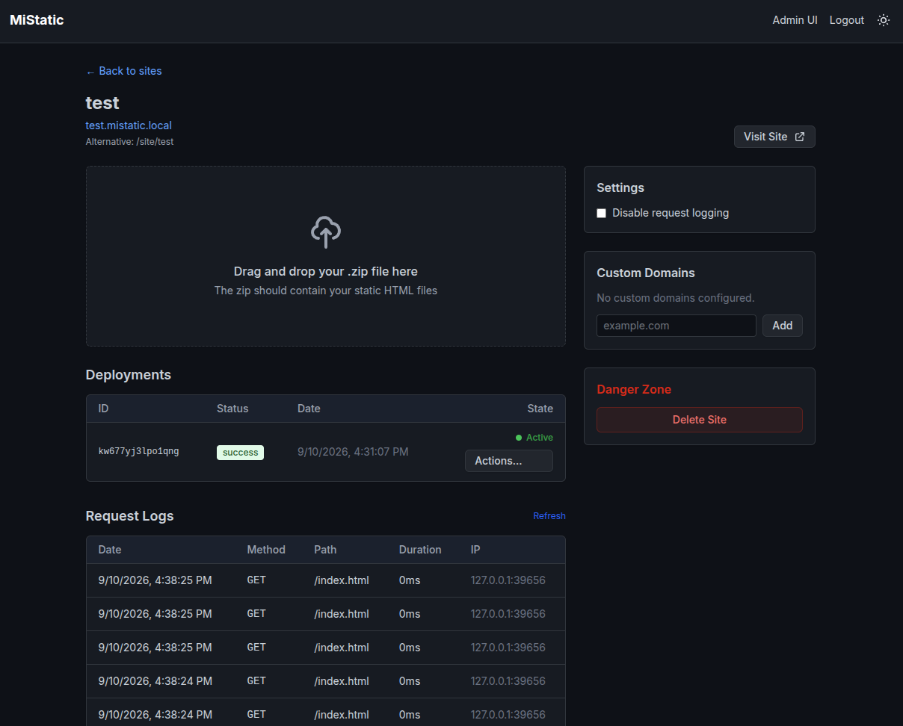
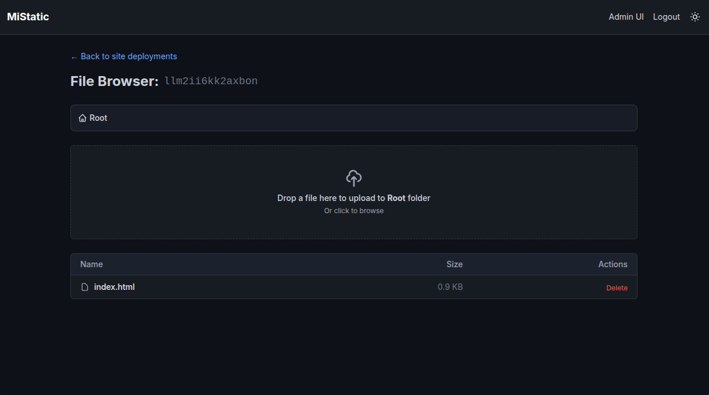

# MiStatic

A highly minimal, on-demand static site hosting platform powered by PocketBase, SvelteKit, and Go.

My main motivation was wanting to deploy quick static sites for demos, or testing, or AI POCs and with most self-hosting solutions like Caprover id need to include a dockerfile for nginx or something to bundle up a web server.

Now, I can click "new site", drop an index.html or a zip and its live.

Since its built on Pocketbase, you instantly get API support (for MCP, or skills or whatever) easy social logins and much more.

## Features

- Custom domain support
- Subpath support if custom domains is too complex
- No containers needed for your projects, pure static files
- No need to edit any nginx config files
- Perfomant request logging with forwarded headers support
- Aggressive caching for site routing
- Mutable deployments (edit files in a live deployment)
- Private sites with SSO
- Deployments and rollbacks

## Screenshots





## Docker Deployment

### Docker CLI

Pull the latest image from Docker Hub:

```bash
docker pull torydocker12784/mistatic:latest
```

Run MiStatic with named volumes for both site deployments and PocketBase data:

```bash
docker run -d \
	--name mistatic \
	--restart unless-stopped \
	-p 8090:8090 \
	-v mistatic_sites:/app/sites \
	-v mistatic_pb_data:/pb/pb_data \
	-e APP_DOMAIN=app.example.com \
	torydocker12784/mistatic:latest
```

Replace `app.example.com` with the hostname used to access the MiStatic dashboard.

### Domain Configuration

- `APP_DOMAIN` is the dashboard hostname. Sites are always available beneath it at
  `https://APP_DOMAIN/site/<subdomain>/`, so this is the only domain variable needed
  when using path-based routing.
- `ROOT_DOMAIN` is optional. Set it when wildcard DNS and your reverse proxy route
  `*.example.com` to MiStatic; each site will then also be available at
  `<subdomain>.example.com`. If omitted, MiStatic falls back to its local-development
  default and path-based routing continues to work.

Exact custom domains configured for individual sites do not require `ROOT_DOMAIN`.

### Docker Compose

Create a `compose.yml`:

```yaml
services:
	mistatic:
		image: torydocker12784/mistatic:latest
		container_name: mistatic
		restart: unless-stopped
		ports:
			- "8090:8090"
		environment:
			APP_DOMAIN: app.example.com
			# Optional: enables <subdomain>.example.com with wildcard DNS/proxy routing.
			# ROOT_DOMAIN: example.com
		volumes:
			- mistatic_sites:/app/sites
			- mistatic_pb_data:/pb/pb_data

volumes:
	mistatic_sites:
	mistatic_pb_data:
```

Start it with:

```bash
docker compose up -d
```

To build the image locally instead, use the repository's unified multi-stage
`Dockerfile`:

```bash
docker build -t mistatic .
```

### FAQ

- Can I add a private site read-only user?
	- Yes, in the Pocketbase admin UI at `app.example.com/_` create a user and selected "Reader" on the "Role" field.

### Publishing Releases

The GitHub Actions workflow requires `DOCKERHUB_USERNAME` and `DOCKERHUB_TOKEN`
repository secrets. A push to `main` publishes the `edge` image for testing. To
publish a stable release, create and push a semantic version tag:

```bash
git tag -a v1.0.0 -m "Release v1.0.0"
git push origin v1.0.0
```

That tag publishes `1.0.0`, `1.0`, `1`, and `latest`. Prerelease tags such as
`v1.1.0-rc.1` publish their exact prerelease version without replacing `latest`.

**Note on SSL:** MiStatic routes HTTP traffic. Put it behind an auto-SSL reverse proxy like **Caddy** or **Traefik** for custom domain HTTPS.

## Architecture

- **PocketBase (Go):** Manages metadata, file routing, and serves the dashboard UI.
- **SvelteKit (Static HTML):** Embedded into the Go binary. A lightweight UI to manage your sites.
- **Tailwind CSS:** GitHub-inspired styles for a clean, minimal interface.

## Local Development Setup

### 1. Configure OS hosts file
To test routing locally, you'll need to fake DNS for your local domains. Edit `/etc/hosts` (Linux/Mac) or `C:\Windows\System32\drivers\etc\hosts` (Windows) and add:

```
127.0.0.1 mistatic.local
127.0.0.1 app.mistatic.local
127.0.0.1 my-project.mistatic.local
```
*(Add additional lines for any custom domains or subdomains you create.)*

### 2. Run the application

Start both the PocketBase backend and SvelteKit frontend simultaneously:

```bash
npm run dev
```

### 3. Access

- **Dashboard:** [http://app.mistatic.local:8090](http://app.mistatic.local:8090)
- **Hosted Sites:** `<subdomain>.mistatic.local:8090`
- **PocketBase Admin:** [http://app.mistatic.local:8090/_/](http://app.mistatic.local:8090/_/)
